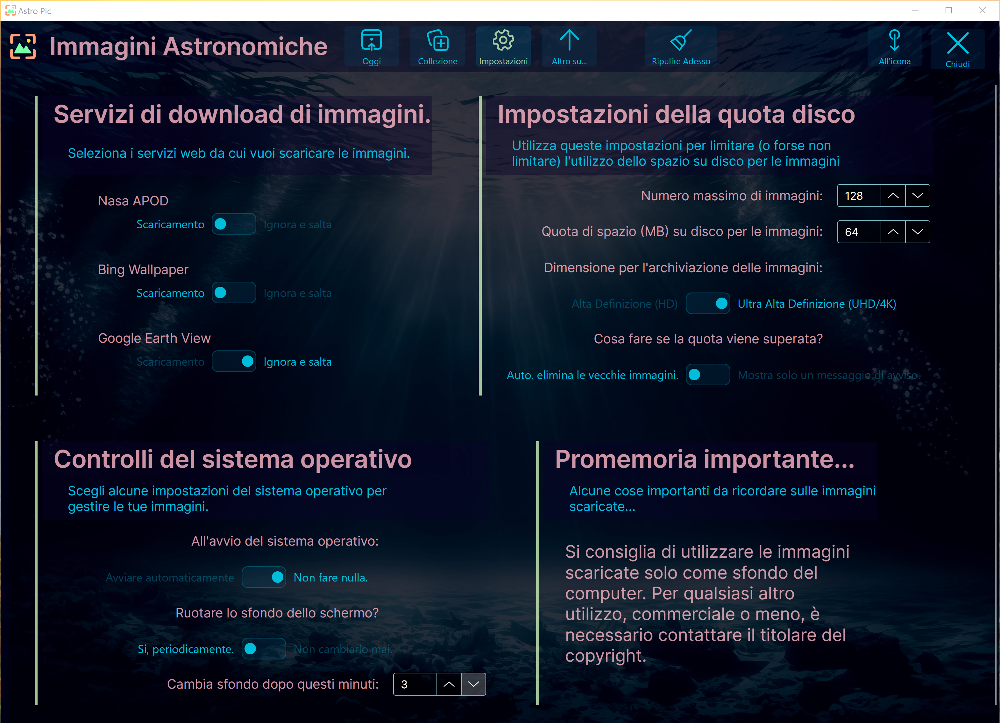

# AstroPic ~ Image Downloader and Wallpaper App'
Downloads and manages images from various online providers: 

- the NASA Astronomy Pictures of the Day (APOD) 
- Bing Wallpaper of the day 
- Google Earth View images
- NASA Epic (Camera onboard the DSCOVR spacecraft.)
- OpenVerse.Org

Then...
- Set image as Wallpaper (Windows Only for now)
- Rotating wallpapers
- Include your own images into the wallpaper collection.
- Managing the image collection 
- Handle user settings.

# Just in...

- Localization for Italian, French and English

# In progress: 

- Localization for Spanish 

# TODO's, hopefully coming soon: 

- Mac OS support
- Autostart (Windows Only for now)
