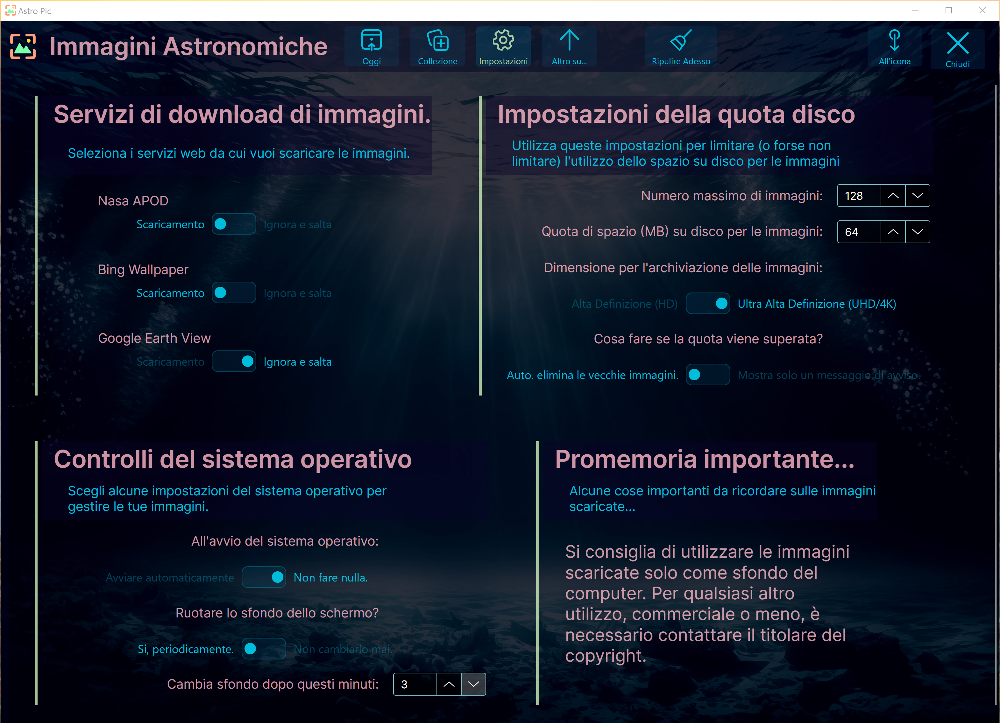

# US Government Shutdown: 
As of November 13th, 2025: The NASA APOD service is now back online, providing new images. 

As of October 14th, 2025: The APOD service is now not responding. The app just times out after a (long) while. 

As of October 3rd, 2025: The APOD service is still live and responding. However it is not updated and the service returns the same image every day. 

# AstroPic ~ Image Downloader and Wallpaper App'
Downloads and manages images from various online providers: 

- the NASA Astronomy Pictures of the Day (APOD) 
- Bing Wallpaper of the day 
- Google Earth View images
- NASA Epic (Camera onboard the DSCOVR spacecraft.)
- OpenVerse.Org

Then...
- Set image as Wallpaper (Windows Only for now)
- Rotating wallpapers
- Include your own images into the wallpaper collection.
- Managing the image collection 
- Handle user settings.

Localization: 
- Human translated: Spanish, Italian, French and English
- Machine translated: Ukrainian, Bulgarian, Armenian, Greek, German, Japanese, Chinese, Korean, Magyar, Hindi and Bengali. 
 

# Last Improvements...

- Upgraded to .Net 10
- Now showing translated image title and descriptions.
- Image information overlay 
- Localization for additional languages using this translation tool: 
 https://github.com/LaurentInSeattle/Lyt.Avalonia.Translator 
- The localization tool has been integrated in the Visual Studio 2026 build as a "pre-build event".

# Given up, On hold: 

- Mac OS support. (No machine for testing.)
- Autostart: Tired to struggle with account security and permissions  

# Settings

# Build your own...

- Clone this repo'
- => Clone the "Lyt.Framework" repo' side by side
- => Clone the "Lyt.Avalonia" repo' side by side
- Open the solution in Visual Studio 2026 and build.

Tested with VS 2026 Insider and Avalonia 11.3.7.
Should likely work with Rider, but not tested.

